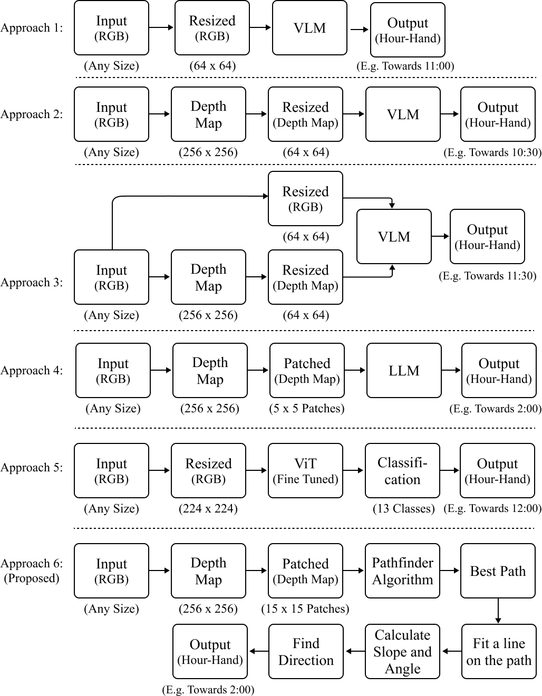

# Real-Time Assistive Navigation for the Visually Impaired: A Scalable and Effiecient Approach for Indoor and Outdoor Mobility

## Overview
Navigating unfamiliar environments remains a significant challenge for people who are blind or have low vision (BLV), with existing tools often falling short in real-time obstacle detection, localization, and adaptability. We present PathFinder, a map-free navigation system that combines Vision-Language Models, Large Language Models, and monocular depth estimation to detect clear paths.
Using a Depth-First Search (DFS) on depth images, PathFinder identifies the longest obstacle-free route efficiently. Evaluations show improved accuracy, faster decision-making, and better real-time performance compared to existing AI navigation tools. User feedback highlights its ease of use, responsiveness, and practicality, though challenges remain in complex indoor and low-light settings.
PathFinder offers a low-cost, scalable approach to enhancing mobility and independence for the BLV community.
 The model architecture is like this: 
#### All Model Architecture:
 

## Quickstart the project
1. Download the code in `ZIP` or open with `GitHub Desktop` or `https://github.com/dabbrata/AI_Assisted_Nav_DFS.git`.
2. Then import `a6_15x15_dfs_pathfinding.ipynb` file to your notebook.
3. Install required python dependencies into your python environment / virtual environment using `pip install -r Requirements.txt`.
4. Run all the cells of that imported (.ipynb) file.

## Dataset
A subset of 300 images was selected from the indoor NYU-Depth V2 and outdoor DIODE datasets, each annotated with ground truth directions based on clock-hour labels. 
Indoor: [NYU-Depth-v2](https://www.kaggle.com/datasets/artemmmtry/nyu-depth-v2) dataset.
Outdoor: [DIODE](https://www.kaggle.com/datasets/artemmmtry/diode-a-dense-indoor-and-outdoor-depth-dataset) dataset.
## Procedure
To evaluate PathFinder, we curated a subset of 300 images from the NYU-Depth V2 (indoor) and DIODE (outdoor) datasets. Each image was annotated with a ground truth navigation direction using clock-hour labels, indicating the most obstacle-free path based on depth information.

Approach 6 of PathFinder utilizes monocular depth estimation to infer scene geometry from a single RGB image. The resulting depth map is then processed using a Depth-First Search (DFS) algorithm to trace the longest navigable path through the scene. This path is mapped to a clock-hour direction (e.g., 12 for straight, 3 for right) to guide navigation intuitively.

The approach does not rely on pre-mapped environments. Instead, it dynamically adapts to new surroundings by analyzing real-time visual input. It combines the interpretability of Large Language Models (LLMs) and the spatial reasoning capabilities of Vision-Language Models (VLMs) to reinforce free-path understanding.

This method was evaluated against existing AI-based navigation solutions. Results showed improved direction prediction accuracy, lower mean absolute error (MAE), and faster response times. A usability study with blind and low-vision (BLV) participants highlighted its ease of use and practical effectiveness, especially in outdoor environments, while also noting areas for improvement in complex indoor and low-light conditions.

## Links and References
- NYU-Depth-v2: https://www.kaggle.com/datasets/artemmmtry/nyu-depth-v2
- DIODE: https://www.kaggle.com/datasets/artemmmtry/diode-a-dense-indoor-and-outdoor-depth-dataset

## Contributors
1. [Argho Deb Das](https://github.com/MrArgho)
2. [Farhan Sadaf](https://github.com/FarhanSadaf)

## Licensing
The code in this project is licensed under [MIT License](LICENSE).
